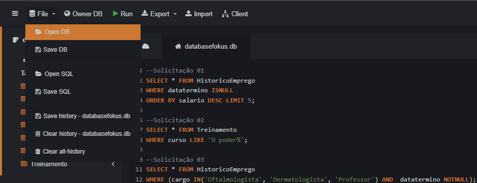
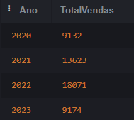
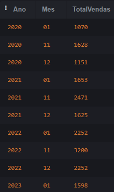
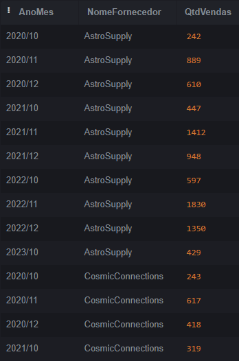
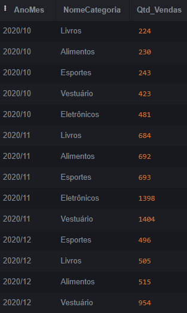
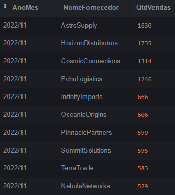
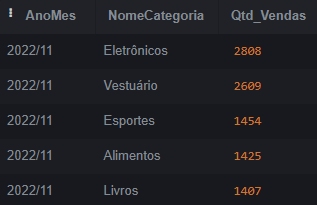
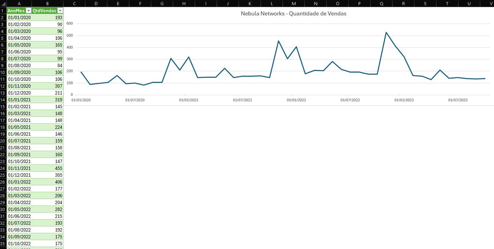

# Database: Zoop MegaStore

</div>
<div align="center">

</div>

A empresa Zoop MegaStore decidiu fazer um grande investimento na BlackFriday com o objetivo de alavancar sua vendas.<br>
E com isso, me chamou para fazer pare do time de análise de dados da empresa, para traçar as estratégias e requisitar análise de dados para que possam tomar decisões baseadas em dados concretos.

## 👨🏻‍💻 Abrir Projeto:

Para realização desse projeto foi utilizado o [SQLiteOnline](https://sqliteonline.com/), então basta realizar o download do banco de dados: <br>
[databasezoop.db](https://github.com/rodrigomoraesdev/database-sql-zoopmegastore/blob/main/databasezoop.db) e abrir o mesmo na opção 'Open DB', conforme abaixo:

<div>

</div>

Disponibilizei também os comandos SQL caso deseje importar separadamente:
[sql-databasezoop.sql](https://github.com/rodrigomoraesdev/database-sql-zoopmegastore/blob/main/sql-databasezoop.sql)

## 💡 Conhecendo o Banco de Dados

Em nosso Banco de Dados temos um breve resumo das tabelas:

💸 Vendas: Registra informações sobre cada venda, incluindo data, valor total e cliente.<br>
📦 Produtos: Armazena detalhes de produtos, como: nome, preço, categoria, marca, fornecedor e status estoque.<br>
🙋🏼‍♀️ Clientes: Contém informações pessoais dos clientes, como: nome, idade e endereço.<br>
🗃️ Categorias: Define as categorias dos produtos.<br>
🚚 Fornecedores: Lista os fornecedores dos produtos com seus contatos.<br>
🏷️ Marcas: Especifica as marcas dos produtos.<br>
🧾 Itens_Venda: Relaciona produtos a vendas específicas e suas quantidades.<br>

## 📝 Introdução

> [!IMPORTANT]<br>
> Nossa equipe foi designada para criar um relatório abrangente que analisará as vendas das últimas Black Fridays. <br>
> Além disso, considerando o cenário geral de vendas da empresa, a equipe de negócios destacou que o mês relevante não se limita apenas à Black Friday, e sim: Novembro, Dezembro e Janeiro. <br>
> A análise resultante deve ser acessível aos profissionais da área de negócios, permitindo que eles executem suas próprias consultas e atualizem as informações conforme necessário.<br>
> O objetivo é fornecer uma visão completa, incluindo os meses que se acredita serem os de maior volume de vendas.

## ▶️ Desenvolvimento

Considerando que a ZOOP Megastore é uma empresa que já vivenciou várias edições da Black Friday ao longo dos anos, nossa análise de dados específica para esse evento requer uma compreensão profunda dos registros de vendas e do período de dados disponíveis.

Sendo assim, montamos a consulta abaixo que nos retorna o Ano com o Total de Vendas respectivo:

```
--Consulta Vendas - Completa
  SELECT STRFTIME('%Y',data_venda) as Ano,
  COUNT(id_venda) AS TotalVendas
  FROM vendas
  GROUP by Ano
  ORDER BY Ano;
```

- Resultado:
<div align='Center'>

</div>

Para obter insights relevantes, refinamos essa consulta na tabela de vendas, contabilizando o número de vendas e agrupando os resultados por ano e mês.<br>
Focamos nos meses correspondentes ao solicitado, além da Black Friday:<br>
Novembro (11), Dezembro (12) e Janeiro (01).<br>

Dessa forma, poderemos extrair informações valiosas sobre o desempenho das vendas durante esse período crucial:

```
--Consulta Vendas - Período Interesse
SELECT STRFTIME('%Y',data_venda) as Ano, STRFTIME('%m',data_venda) as Mes,
COUNT(id_venda) AS TotalVendas
FROM vendas
where Mes = '01' OR Mes = '11' OR Mes = '12'
GROUP by Ano, Mes
ORDER BY Ano;

```

- Resultado:
<div align='Center'>

</div>

> [!NOTE]<br>
> O projeto de análise de dados para a Zoop Megastore avançou para uma nova etapa.<br>
> Fomos convidados para participar da reunião trimestral, cujo tema será a Black Friday.<br>
> Vamos participar dessa reunião com o propósito de auxiliar na resposta a questões que possam surgir durante a elaboração das estratégias para a Black Friday deste ano.

Para participarmos dessa reunião entendo ser interessante já prepararmos algumas consultas com o objetivo de agilizar o processo.

A Pauta da reunião enviada foi:

- O papel dos fornecedores na Black Friday;
- A categoria de produtos da Black Friday;
- E a performance das Black Friday anteriores e futuras.

Em relação ao último tópico, não sabemos ainda como podemos montar uma consulta para ajudar nessa questão, <br>
Sendo assim iremos nesse primeiro momento focar nos 2 primeiros tópicos, que entendo serem os principais no momento para adotar uma estrategia efetiva para a próxima Black Friday:

- O papel dos fornecedores na Black Friday;

Para esse tópico estamos interessados na Quantidade de Produtos vendidos por Fornecedor, sendo assim montei a consulta abaixo:<br>
Nela temos o campo de AnoMes, seguido do Nome dos Fornecedores, pelo qual ordenamos as informações, seguido da Quantidade de Vendas. <br>
Isso tudo referente ao período de interesse que foi solicitado.<br>
Assim fica fácil realizarmos comparações, caso surgir alguma dúvida na reunião:

```
SELECT STRFTIME('%Y/%m', v.data_venda) AS AnoMes, f.nome AS NomeFornecedor, COUNT(iv.produto_id) AS QtdVendas
FROM itens_venda iv
JOIN vendas v ON v.id_venda = iv.venda_id
JOIN produtos p ON iv.produto_id = p.id_produto
JOIN fornecedores f ON f.id_fornecedor = p.fornecedor_id
where AnoMes LIKE '%/10%' OR AnoMes LIKE '%/11%' OR AnoMes LIKE '%/12%'
GROUP By NomeFornecedor, "AnoMes"
ORDER BY NomeFornecedor;
```

- Resultado:

<div align='Center'>

</div>

- A categoria de produtos da Black Friday;

Para esse tópico estamos interessados na Quantidade de Produtos vendidos por Categoria, sendo assim montei a consulta abaixo:<br>
Nela temos o campo de AnoMes, seguido do Nome das Categorias, pelo qual ordenamos as informações, seguido da Quantidade de Vendas. <br>
Isso tudo referente ao período de interesse que foi solicitado.<br>
Assim fica fácil realizarmos comparações, caso surgir alguma dúvida na reunião:

```
SELECT STRFTIME('%Y/%m', v.data_venda) AS AnoMes, c.nome_categoria AS NomeCategoria, COUNT(iv.produto_id) AS Qtd_Vendas
FROM itens_venda iv
JOIN vendas v ON v.id_venda = iv.venda_id
JOIN produtos p ON p.id_produto = iv.produto_id
JOIN categorias c ON c.id_categoria = p.categoria_id
where AnoMes LIKE '%/10%' OR AnoMes LIKE '%/11%' OR AnoMes LIKE '%/12%'
GROUP BY NomeCategoria, AnoMes
ORDER BY AnoMes, Qtd_Vendas;
```

- Resultado:

<div align='Center'>

</div>

> [!NOTE]<br>
> Com as consultas prontas, já estamos prontos para iniciar a reunião:

<details><summary>🎧Transcrição Reunião:</summary>

`Rodrigo`: Olá, Mirla.<br>
Tudo bem? Sou o Rodrigo, do time de análise de dados.<br>
Recebemos uma demanda do comercial sobre algumas dúvidas para a Black Friday deste ano. É isso mesmo?

`Mirla`: Perfeito, Rodrigo.<br>
Exatamente. Estamos começando a tomar decisões estratégicas para a nossa Black Friday, e para tomar essas decisões, vamos precisar de algumas respostas suas quanto aos dados que temos referentes à última Black Friday que aconteceu no ano passado.<br>
Gostaríamos de saber, quais foram os fornecedores que mais venderam na Black Friday de 2022.<br>
Você consegue nos informar?

`Rodrigo`: Claro, preparamos algumas consultas já referente aos fornecedores.<br>
Vou fazer apenas uma pequena modificação para aplicar esse filtro especifico que solicitou quanto ao período apenas na Black Friday de 2022, assim como ordenar pela quantidade:

```
SELECT STRFTIME('%Y/%m', v.data_venda) AS AnoMes, f.nome AS NomeFornecedor, COUNT(iv.produto_id) AS QtdVendas
FROM itens_venda iv
JOIN vendas v ON v.id_venda = iv.venda_id
JOIN produtos p ON iv.produto_id = p.id_produto
JOIN fornecedores f ON f.id_fornecedor = p.fornecedor_id
WHERE STRFTIME('%Y/%m', v.data_venda) = '2022/11'
GROUP BY NomeFornecedor, "AnoMes"
ORDER BY QtdVendas DESC;
```

- Resultado:



`Rodrigo`: Na última Black Friday em 2022/11, quem vendeu mais foi a AstroSupply, com 1.830 vendas, e a HorizonDistributors, com 1.735 vendas.<br>

`Mirla`: Nas conversas que tivemos no setor, surgiu a informação de que provavelmente o NebulaNetworks teve um desempenho inferior na última Black Friday.<br>
Gostaríamos de confirmar se realmente foi o NebulaNetworks que menos vendeu na última Black Friday.

`Rodrigo`: Podemos confirmar isso, na verdade nessa mesma tabela, como a ordenação vai do menor para o maior, conseguimos ir no último registro e confirmar que foram eles.<br>
O NebulaNetworks teve 529 vendas. Portanto, foi uma performance bem abaixo, se compararmos com os outros Fornecedores.

`Mirla`: Também estamos planejando algumas Categorias que queremos colocar na página inicial para torná-la mais atraente.<br>
Você consegue nos informar quais delas venderam mais na Black Friday de 2022 para tomarmos essa prioridade?

`Rodrigo`: Claro, também temos já uma consulta preparada também para as Categorias.<br>
Asim como nos Fornecedores vou fazer apenas uma pequena modificação para aplicar esse filtro especifico que solicitou quanto ao período penas na Black Friday de 2022, assim como ordenar pela quantidade:

```
SELECT STRFTIME('%Y/%m', v.data_venda) AS AnoMes, c.nome_categoria AS NomeCategoria, COUNT(iv.produto_id) AS Qtd_Vendas
FROM itens_venda iv
JOIN vendas v ON v.id_venda = iv.venda_id
JOIN produtos p ON p.id_produto = iv.produto_id
JOIN categorias c ON c.id_categoria = p.categoria_id
WHERE STRFTIME('%Y/%m', v.data_venda) = '2022/11'
GROUP BY NomeCategoria, AnoMes
ORDER BY AnoMes, Qtd_Vendas DESC;
```

- Resultado:



`Rodrigo`: Olhando para 2022, temos cinco resultados para Novembro.<br>
Vendemos mais nas categorias de Eletrônicos e Vestuário, sendo "Eletrônicos" com 2.808 vendas e "Vestuário" com 2.609 vendas.

`Mirla`: Ótimo! Para fechar o planejamento, você consegue me informar quais dessas Categorias menos venderam?

`Rodrigo`: Claro, a Categoria que teve menos venda foi a de "Livros", com 1.407 vendas.<br>
Porém, acredito importante reforçar que existiu uma proximidade no número de vendas de "Alimentos" e "Esportes", respectivamente, 1.425 e 1.454.<br>
Então, por mais que "Livros" tenha sido a que menos vendeu, ela está bem próxima a essas outras duas Categorias.

`Mirla`: Isso vai me ajudar muito! Ainda há um ponto antes de encerrar.<br>
Você falou da NebulaNetworks e me veio a ideia de conversar com esse fornecedor, mas gostaríamos de levar dados para mostrar o desempenho de vendas deles, até para negociar novos valores.<br>
Você consegue trazer esse conjunto de dados para levarmos a eles?

`Rodrigo`: Sim, temos acesso a essa informação, como é uma consulta de um Fornecedor em especifico, precisaríamos pensar com calma para montar essa consulta.<br>
Podemos fornecer esses dados posteriormente por e-mail?

`Mirla`: Pode ser sim, mas só mais uma dúvida: Esses dados estão realmente atualizados, certo?

`Rodrigo`: É uma boa pergunta, temos a informação oficial que são 150.034 registros. Então, conseguimos usar essa consulta para fazer essa validação:<br>

Na parte dos dados dos fornecedores, vamos remover o filtro quanto ao período, e vamos transformar essa consulta em uma sub consulta.<br>
No FROM, entre parênteses, vamos colocar a sub consulta.
Vamos adicionar o comando SELECT ao início da consulta e fazer uma soma SUM() da quantidade de vendas (Qtd_Vendas).<br>

```
SELECT SUM(QtdVendas) AS TotalRegistros
FROM (
  SELECT STRFTIME('%Y/%m', v.data_venda) AS AnoMes, f.nome AS NomeFornecedor, COUNT(iv.produto_id) AS QtdVendas
  FROM	 itens_venda iv
  JOIN vendas v ON v.id_venda = iv.venda_id
  JOIN produtos p ON iv.produto_id = p.id_produto
  JOIN fornecedores f ON f.id_fornecedor = p.fornecedor_id
  GROUP BY NomeFornecedor, "AnoMes"
  ORDER BY NomeFornecedor);
```

- Resultado:


Após selecionar a consulta e apertar "Run", é retornado o valor de 150.034 vendas.<br>
Sendo assim, os dados estão atualizados, Mirla, pode ficar tranquila!

`Mirla`: Perfeito, Rodrigo. <br>
Agora que temos essa confiança de que os dados realmente estão atuais, vamos ficar no aguardo de você mandar esse conjunto de dados, ok?<br>
<br>
Até a próxima. Muito obrigada pelo seu tempo!<br>

`Rodrigo`: Obrigado, Mirla. Até mais!

</details>
<br>

---

Após a reunião ficamos responsáveis por enviar ao negócio, as informações de desempenho apenas do Fornecedor: NebulaNetworks.<br>
Sendo assim, aproveitei o código que já havíamos construído para os Fornecedores, e modifiquei para trazer o AnoMes e a Quantidade de Vendas, isso apenas do Fornecedor NebulaNetworks:

```
--Solicitação: Detalhes QtdVendas NebulaNetworks
SELECT STRFTIME('%Y/%m', v.data_venda) AS AnoMes, cOUNT(iv.produto_id) AS QtdVendas
FROM itens_venda iv
JOIN vendas v ON v.id_venda = iv.venda_id
JOIN produtos p ON iv.produto_id = p.id_produto
JOIN fornecedores f ON f.id_fornecedor = p.fornecedor_id
WHERE f.nome = 'NebulaNetworks'
GROUP By f.nome, "AnoMes"
ORDER BY AnoMes, QtdVendas DESC;
```

Esse resultado acima, estamos falamos de 4 anos, ou seja 46 linhas de informação, enviar os dados dessa forma para o time de negócio não é interessante.<br>
Como haviam informado anteriormente que as informações devem ser acessíveis aos profissionais da área de negócios, permitindo que eles executem suas próprias consultas e atualizem as informações conforme necessário.<br>
Realizei a exportação desses dados como CSV,



Além disso, pensei que seria interessante também o negócio conseguir visualmente comparar a NebulaNetwork com outros 2 Melhores Fornecedores.<br>
Porém para ficar no mesmo padrão anterior, precisamos colocar cada Fornecedor como uma coluna, sendo assim aproveitei o código anterior onde declarei o operador OR para trazer os 3 Fornecedores em questão, assim como utilizei esse código como um sub-consulta, onde na consulta principal, para separar os Fornecedores em cada coluna, utilizamos o CASE, onde caso o Fornecedor for o que buscamos, ele irá trazer a Quantidade de Vendas:

```
--Adicional: Detalhes Qtd Vendas NebulaNetworks + Top2Fornecedores
SELECT AnoMes,
SUM(CASE WHEN NomeFornecedor == 'NebulaNetworks' THEN QtdVendas ELSE 0 END) AS NebulaNetworks_QtdVendas,
SUM(CASE WHEN NomeFornecedor == 'AstroSupply' THEN QtdVendas ELSE 0 END) AS AstroSupply_QtdVendas,
SUM(CASE WHEN NomeFornecedor == 'HorizonDistributors' THEN QtdVendas ELSE 0 END) AS HorizonDistributors_QtdVendas
FROM(
  SELECT STRFTIME('%Y/%m', v.data_venda) AS AnoMes, f.nome AS NomeFornecedor, COUNT(iv.produto_id) AS QtdVendas
  FROM itens_venda iv
  JOIN vendas v ON v.id_venda = iv.venda_id
  JOIN produtos p ON iv.produto_id = p.id_produto
  JOIN fornecedores f ON f.id_fornecedor = p.fornecedor_id
  WHERE f.nome = 'NebulaNetworks' OR f.nome = 'AstroSupply' OR f.nome = 'HorizonDistributors'
  GROUP BY NomeFornecedor, "AnoMes"
  ORDER BY NomeFornecedor
 )
 GROUP BY AnoMes;

```


Além disso também nesse mesmo formato e material, estarei enviando um Quadro Geral do Total de Vendas Geral,

```
 --Quadro Geral
 SELECT STRFTIME('%Y/%m', data_venda) AS AnoMes, COUNT(*) AS QtdVendas
 FROM vendas
 GROUP by AnoMes
 ORDER by AnoMes;
```


> [!NOTE]<br>
> Os gráficos estão disponíveis para download no arquivo: [analisegrafica.xlsx](https://github.com/rodrigomoraesdev/database-sql-zoopmegastore/blob/main/analisegrafica.xlsx)

## 📏 Métricas

Como um dos objetivos é que essa análise resultante deve ser acessível aos profissionais da área de negócios, permitindo que eles executem suas próprias consultas e atualizem as informações conforme necessário.<br>
Desenvolvi a métrica abaixo que traz a Média de Quantidade de Vendas dos anos anteriores, a Quantidade de Vendas do Ano atual e a Porcentagem de comparação entre os anos.
Essa métrica pode ser utilizada para a equipe de negócio, alterando apenas o ano a medida que avançam no tempo:

```
WITH Media_Vendas_Anteriores AS (SELECT AVG(Qtd_Vendas) AS Media_Qtd_Vendas
FROM (
    SELECT COUNT(*) AS Qtd_Vendas, strftime('%Y', v.data_venda) AS Ano
    FROM vendas v
    WHERE strftime('%m', v.data_venda) = '11' AND Ano != '2022'
    GROUP BY Ano
)), Vendas_Atual AS (SELECT Qtd_Vendas AS Qtd_Vendas_Atual
FROM(
    SELECT COUNT(*) AS Qtd_Vendas, strftime('%Y', v.data_venda) AS Ano
    FROM vendas v
    WHERE strftime('%m', v.data_venda) = '11' AND Ano = '2022'
    GROUP BY Ano
    ))
    SELECT
    mva.Media_Qtd_Vendas,
    va.Qtd_Vendas_Atual,
    ROUND((va.Qtd_Vendas_Atual - mva.Media_Qtd_Vendas)/mva.Media_Qtd_Vendas *100.0, 2) || '%' AS Porcentagem
    FROM Vendas_Atual va, Media_Vendas_Anteriores mva
```

## 📊 Relatório Final

Sendo assim, por último montei o Relatório Final, que foi enviado ao negócio, você pode realizar o downland do mesmo:<br>
[Relatório de Black Friday - Zoop.docx](https://github.com/rodrigomoraesdev/database-sql-zoopmegastore/blob/main/Relat%C3%B3rio%20de%20Black%20Friday%20-%20Zoop.docx)<br>
Ele contém de forma simples e direta os resultados com dados e informações uteis para que eles possam tomas as decisões mais assertivas para próxima Black Friday.

---

## 📚 Conhecimentos

Para estudo e aplicação do projeto, Utilizei os conteúdos:

- [SQLite online: análise de dados com SQL](https://cursos.alura.com.br/course/sqlite-online-analise-dados-sql)

## 🤖 Tecnologias

<div style="display: flex">
  
</div>

---

- `SQL`: O SQL é a linguagem de programação utilizada para gerenciamento e consulta de Banco de Dados Relacionais, permitindo: Criar, Ler, Atualizar e Deletar (CRUD "Create","Read", "Update" e "Delete").

---

**Desenvolvido por [Rodrigo Moraes](https://github.com/rodrigomoraesdev)**
